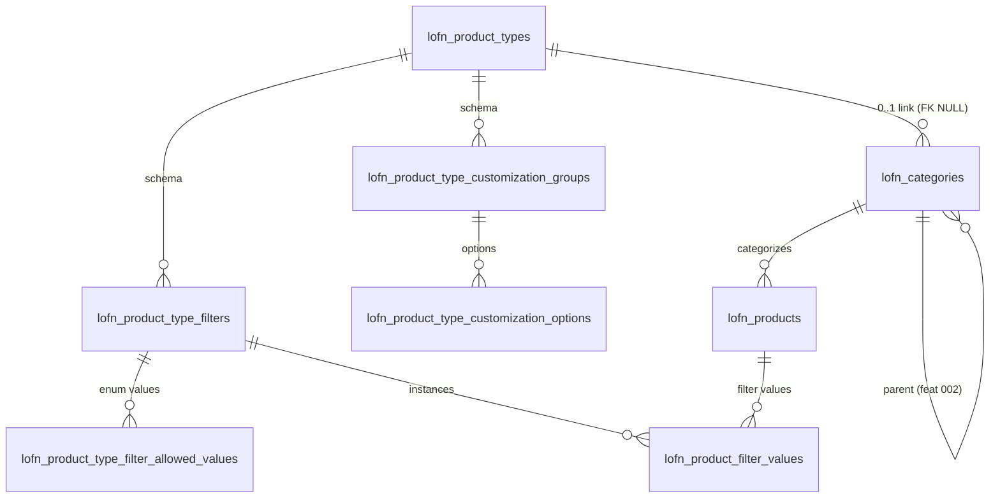

# Phase 1 — Data Model

**Feature**: 003-product-type-filters
**Spec**: [spec.md](./spec.md)
**Plan**: [plan.md](./plan.md)
**Research**: [research.md](./research.md)

Modelo relacional concreto, em formato PostgreSQL, com FKs, índices e regras de cascade. Tudo é tenant-scoped via DbContext (`TenantDbContextFactory` resolve a connection string por tenant).

---

## Tabela: `lofn_product_types`

Classificador tenant-scoped declarado pelo admin.

| Coluna | Tipo | Constraints | Descrição |
|--------|------|-------------|-----------|
| `product_type_id` | `bigserial` | PK | Identidade autoincrement |
| `name` | `varchar(120)` | NOT NULL, UNIQUE | Nome único no tenant (ex.: "Calçado") |
| `description` | `varchar(500)` | NULL | Descrição livre opcional |
| `created_at` | `timestamp` | NOT NULL DEFAULT now() | |
| `updated_at` | `timestamp` | NOT NULL DEFAULT now() | |

**Indexes**: PK, UK em `name` (case-sensitive — tenant-único responsável pela disciplina).

**Lifecycle**: Hard delete cascateia em filtros, allowed_values, groups, options. Categorias vinculadas têm `product_type_id` setado para NULL (FK ON DELETE SET NULL).

---

## Tabela: `lofn_product_type_filters`

Schema de filtros sob um Tipo. Identidade estável independente do `label`.

| Coluna | Tipo | Constraints | Descrição |
|--------|------|-------------|-----------|
| `filter_id` | `bigserial` | PK | Identidade estável |
| `product_type_id` | `bigint` | NOT NULL, FK → lofn_product_types(product_type_id) ON DELETE CASCADE | Tipo dono do filtro |
| `label` | `varchar(120)` | NOT NULL | Rótulo exibido (ex.: "Número") |
| `data_type` | `varchar(20)` | NOT NULL, CHECK IN ('text','integer','decimal','boolean','enum') | Discriminador de tipo de valor |
| `is_required` | `boolean` | NOT NULL DEFAULT false | Se obrigatório no cadastro do produto |
| `display_order` | `int` | NOT NULL DEFAULT 0 | Ordenação na UI (admin define) |
| `created_at` | `timestamp` | NOT NULL DEFAULT now() | |
| `updated_at` | `timestamp` | NOT NULL DEFAULT now() | |

**Indexes**:
- PK
- UK composta `(product_type_id, label)` — FR-005: dois filtros com mesmo rótulo no mesmo tipo proibido.
- IDX `(product_type_id)` para listar filtros de um tipo (já coberto pelo UK).

**Validation rules** (FluentValidation):
- `label`: NotEmpty, MaxLength(120)
- `data_type`: must be one of {text, integer, decimal, boolean, enum}
- Quando `data_type = 'enum'`: ao salvar precisa ter ≥1 entrada em `lofn_product_type_filter_allowed_values` (validação cross-table no service, não no validator de DTO).

---

## Tabela: `lofn_product_type_filter_allowed_values`

Valores permitidos para filtros do tipo `enum`. Apenas existe se `data_type = 'enum'`.

| Coluna | Tipo | Constraints | Descrição |
|--------|------|-------------|-----------|
| `allowed_value_id` | `bigserial` | PK | |
| `filter_id` | `bigint` | NOT NULL, FK → lofn_product_type_filters(filter_id) ON DELETE CASCADE | |
| `value` | `varchar(120)` | NOT NULL | Valor permitido (ex.: "Masculino") |
| `display_order` | `int` | NOT NULL DEFAULT 0 | |

**Indexes**:
- PK
- UK `(filter_id, value)` — não pode haver duplicatas no mesmo enum.

---

## Tabela: `lofn_product_type_customization_groups`

Grupos de customização sob um Tipo. Type-only (Q1:A).

| Coluna | Tipo | Constraints | Descrição |
|--------|------|-------------|-----------|
| `group_id` | `bigserial` | PK | |
| `product_type_id` | `bigint` | NOT NULL, FK → lofn_product_types(product_type_id) ON DELETE CASCADE | |
| `label` | `varchar(120)` | NOT NULL | Rótulo do grupo (ex.: "Processador") |
| `selection_mode` | `varchar(10)` | NOT NULL, CHECK IN ('single','multi') | Semântica de seleção |
| `is_required` | `boolean` | NOT NULL DEFAULT false | Se o comprador precisa selecionar ≥1 opção |
| `display_order` | `int` | NOT NULL DEFAULT 0 | |
| `created_at` | `timestamp` | NOT NULL DEFAULT now() | |
| `updated_at` | `timestamp` | NOT NULL DEFAULT now() | |

**Indexes**:
- PK
- UK `(product_type_id, label)` — dois grupos com mesmo rótulo no mesmo tipo proibido (paridade com filtros).

**Validation rules**:
- `label`: NotEmpty, MaxLength(120)
- `selection_mode`: must be one of {single, multi}

---

## Tabela: `lofn_product_type_customization_options`

Opções dentro de um grupo. Carregam o `price_delta` (signed centavos).

| Coluna | Tipo | Constraints | Descrição |
|--------|------|-------------|-----------|
| `option_id` | `bigserial` | PK | Identidade estável (futuro snapshot em pedido referenciará isso) |
| `group_id` | `bigint` | NOT NULL, FK → lofn_product_type_customization_groups(group_id) ON DELETE CASCADE | |
| `label` | `varchar(120)` | NOT NULL | Rótulo da opção (ex.: "i7") |
| `price_delta_cents` | `bigint` | NOT NULL DEFAULT 0 | Delta signed em centavos (positivo OU negativo OU 0) |
| `is_default` | `boolean` | NOT NULL DEFAULT false | Apenas relevante em groups single-select |
| `display_order` | `int` | NOT NULL DEFAULT 0 | |
| `created_at` | `timestamp` | NOT NULL DEFAULT now() | |
| `updated_at` | `timestamp` | NOT NULL DEFAULT now() | |

**Indexes**:
- PK
- UK `(group_id, label)` — FR-020: rótulos únicos por grupo.
- Partial UK `(group_id) WHERE is_default = true` em groups single-select (enforced no service, não no DB — há grupos multi onde múltiplas defaults são tolerada como pre-seleção; v1 não implementa isso, mas a regra de "no máximo 1 default em single-select" fica no service).

**Validation rules**:
- `label`: NotEmpty, MaxLength(120)
- `price_delta_cents`: pode ser negativo (refletir desconto), mas o cálculo final precisa garantir total ≥ 0 (regra do service, não do DTO).

---

## Tabela: `lofn_product_filter_values`

Valores concretos preenchidos por vendedor para um produto. EAV polimórfico (ver R1).

| Coluna | Tipo | Constraints | Descrição |
|--------|------|-------------|-----------|
| `product_filter_value_id` | `bigserial` | PK | |
| `product_id` | `bigint` | NOT NULL, FK → lofn_products(product_id) ON DELETE CASCADE | |
| `filter_id` | `bigint` | NOT NULL, FK → lofn_product_type_filters(filter_id) ON DELETE CASCADE | |
| `value` | `text` | NOT NULL | Valor stringificado (interpretado por `filter.data_type`) |
| `created_at` | `timestamp` | NOT NULL DEFAULT now() | |
| `updated_at` | `timestamp` | NOT NULL DEFAULT now() | |

**Indexes**:
- PK
- UK `(product_id, filter_id)` — um produto tem 0..1 valor por filtro (não multivalorado, conforme Out of Scope).
- IDX `(filter_id, value)` — coberto pelo cenário dominante de busca por igualdade.

**Validation rules** (`ProductFilterValueResolver`):
- O `filter_id` deve pertencer ao tipo aplicável da categoria do produto. Caso contrário rejeita.
- `value` deve ser parseable de acordo com `filter.data_type`:
  - `text`: aceita qualquer string (limite implícito do tipo `text`)
  - `integer`: parseable como `long`
  - `decimal`: parseable como `decimal` (cultura invariante, ponto)
  - `boolean`: aceita `"true"` ou `"false"` literalmente
  - `enum`: deve estar em `lofn_product_type_filter_allowed_values` do `filter_id`

---

## Alteração: `lofn_categories`

Nova coluna FK 0..1 para Tipo de Produto.

| Coluna nova | Tipo | Constraints | Descrição |
|-------------|------|-------------|-----------|
| `product_type_id` | `bigint` | NULL, FK → lofn_product_types(product_type_id) ON DELETE SET NULL | Tipo aplicado diretamente. NULL = herda do ancestral (closest-ancestor). |

**Indexes**:
- IDX `(product_type_id)` — para listar categorias por tipo (operação admin).

**Migration impact**: Categorias pré-existentes ficam com `product_type_id = NULL` — comportamento legado (sem tipo aplicado, sem schema de filtros sugerido). Aditivo, sem perda de dado.

---

## Alteração: `lofn_products`

Sem mudança estrutural. Ganha relacionamento 1:N navegacional para `lofn_product_filter_values` (não nova coluna).

---

## Diagrama de relações

---

## Estados e transições

### ProductType
- **Created**: insert via `POST /producttype/insert`. Sem filtros nem grupos no momento.
- **Schema-edited**: filtros e grupos podem ser CRUD-ados a qualquer tempo. Edições têm efeito imediato no schema exposto.
- **Linked-to-category**: zero ou mais categorias podem referenciá-lo via `lofn_categories.product_type_id`.
- **Deleted**: hard delete cascateia tudo, nullifica vínculos em categoria. Operação irreversível.

### ProductTypeFilter
- **Created**: insert via `POST /producttype/{typeId}/filter/insert`. Inicia sem `allowed_values` se `data_type = 'enum'` (o service exige ≥1 antes de aceitar; admin precisa adicionar valores na mesma operação ou em transação separada — a UI orquestra).
- **Renamed**: `label` muda, `filter_id` permanece. Valores históricos seguem associados.
- **Type-changed (data_type)**: PROIBIDO no v1. Mudar de `text` para `integer` invalidaria valores históricos. Service recusa. Admin deve excluir o filtro e criar um novo.
- **Deleted**: cascade em `allowed_values` e `product_filter_values`.

### CustomizationOption
- **Created/Updated**: CRUD direto. Mudança em `price_delta_cents` afeta cálculos novos imediatamente. Pedidos passados não existem ainda (Out of Scope) — quando feature de pedido sair, cobra snapshot na linha.
- **Marked default**: apenas em groups single-select. No máximo 1 por grupo. Service enforça.
- **Deleted**: hard delete sem efeito colateral nesta release.

### ProductFilterValue
- **Set/Updated**: ao cadastrar/editar produto via `POST /product/.../insert` ou `update` com lista de pares `(filterId, value)`. Service aplica reconciliation: insert novos, update existentes, delete ausentes.
- **Orphaned**: se o admin deleta o filtro que referencia, cascade do banco apaga estes registros automaticamente.

### Category-ProductType link
- **Linked**: admin chama `PUT /category/{categoryId}/producttype/{typeId}`. Categoria passa a aplicar o schema do tipo diretamente.
- **Unlinked**: admin chama `DELETE /category/{categoryId}/producttype`. Categoria volta a herdar do ancestral mais próximo (ou ficar sem tipo se nenhum ancestral tiver).
- **Replaced**: chamar `PUT` em uma categoria já vinculada substitui o tipo. Valores de filtro de produtos da categoria são preservados (FK por id), mas só os filtros do novo tipo viram facetas/validação. (Edge case da spec.)

---

## Constraints de negócio (impostas no Domain, não pelo banco)

1. **Filtro `enum` precisa ter ≥1 `allowed_value`** — service valida antes de aceitar create/update.
2. **Group single-select aceita no máximo 1 option `is_default = true`** — service valida.
3. **`label` único por escopo** — coberto pelo UK do banco, mas o erro é traduzido pelo service para mensagem amigável.
4. **Renomear não pode quebrar identidade** — não há regra de service; é design (FK por id).
5. **Mudar `data_type` de filtro proibido** — service recusa update que tente mudar `data_type`.
6. **Tipo aplicável a um produto = tipo da categoria do produto, ou closest-ancestor**. Resolução pelo `CategoryRepository.GetAppliedProductTypeAsync`.
7. **Cadastro de produto sem tipo aplicável é OK** — fluxo legado preservado.
8. **Filtros marcados `is_required` viram regra dura no insert/update do produto** — service valida; resposta lista todos faltando.
9. **Valores extras ignorados silenciosamente** — service descarta com aviso não-bloqueante; resposta inclui `ignoredFilterIds: long[]`.
